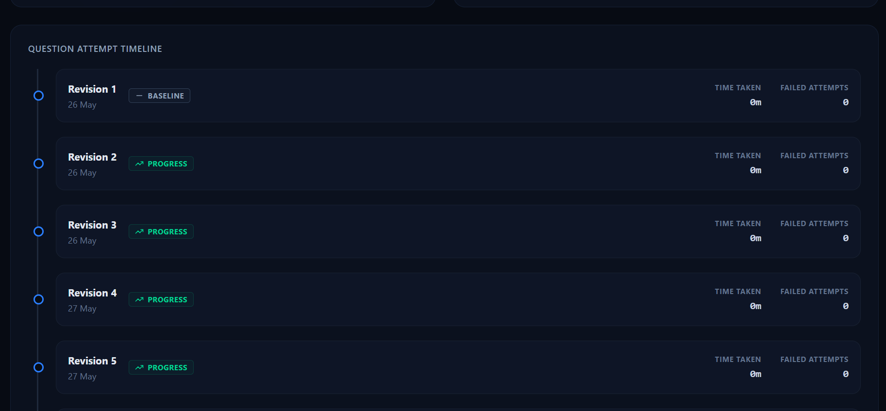
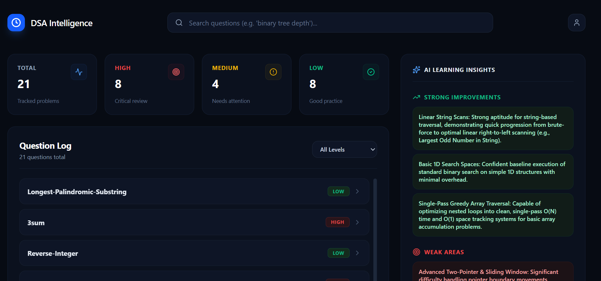
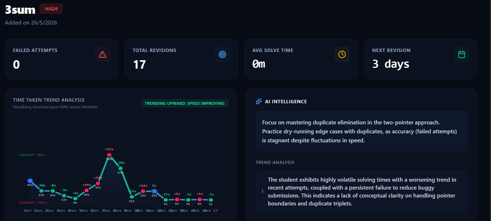

<h1 align="center">
  DSA Behavioral Intelligence System
</h1>

  An AI-powered behavioral intelligence system that tracks DSA problem-solving patterns and generates personalized revision insights using behavioral learning analytics.

<h2>🚀 Features</h2>

<ul>
  <li>Chrome Extension based behavioral tracking</li>
  <li>Active coding time tracking</li>
  <li>Wrong answer detection</li>
  <li>Revision attempt tracking</li>
  <li>MongoDB behavioral history storage</li>
  <li>Learning trend analysis engine</li>
  <li>AI-powered question-level intelligence</li>
  <li>AI-powered global learning intelligence</li>
  <li>Personalized revision recommendations</li>
</ul>

<h2>🛠️ Tech Stack</h2>

<h3>Frontend Layer</h3>
<ul>
  <li>React.js</li>
  <li>Tailwind CSS</li>
</ul>

<h3>Backend Layer</h3>
<ul>
  <li>Node.js</li>
  <li>Express.js</li>
  <li>MongoDB</li>
  <li>Event-driven processing pipeline</li>
  <li>Fault-tolerant retry-safe architecture</li>
</ul>

<h3>AI Intelligence Layer</h3>
<ul>
  <li>Gemini API</li>
  <li>Prompt Engineering</li>
  <li>Behavioral Trend Analysis Engine</li>
  <li>Dual Intelligence System (Question + Global)</li>
</ul>

<h3>Extension Layer</h3>
<ul>
  <li>Chrome Extension APIs</li>
  <li>MutationObserver</li>
  <li>Content Scripts</li>
</ul>

<h2>⚙️ System Workflow</h2>

<h3>1. Behavioral Tracking Layer</h3>
<ul>
  <li>Tracks active solving duration</li>
  <li>Detects wrong submissions</li>
  <li>Monitors question switching behavior</li>
  <li>Sends event logs to backend</li>
</ul>

<h3>2. Backend Processing Layer</h3>
<ul>
  <li>Stores attempt logs in MongoDB</li>
  <li>Triggers question-level intelligence pipeline</li>
  <li>Evaluates global intelligence checkpoints</li>
</ul>

<h3>3. Intelligence Layer (Dual System)</h3>

<h4>🔹 Question-Level Intelligence</h4>
<ul>
  <li>Analyzes individual problem-solving behavior</li>
  <li>Detects retention decay per question</li>
  <li>Generates revision priority per problem</li>
</ul>

<h4>🔹 Global Intelligence System</h4>
<ul>
  <li>Analyzes entire DSA learning behavior</li>
  <li>Triggered every N attempts (fault-safe checkpoint system)</li>
  <li>Aggregates weak/strong topic patterns</li>
</ul>

<h2>🧠 Fault-Tolerant Intelligence Pipeline</h2>

The system uses a resilient event-driven architecture to ensure no data loss and controlled AI execution.

<h3>Pipeline Flow</h3>

<pre>
Chrome Extension
        ↓
API Layer (Node.js)
        ↓
MongoDB (Persistent Log Storage)
        ↓
Question Intelligence Engine
        ↓
Checkpoint Validator
        ↓
Global Intelligence Trigger (Every 5 attempts)
        ↓
AI Processing Layer (Gemini API)
        ↓
Intelligence Storage Layer
        ↓
Frontend Dashboard
</pre>

<h3>⚡ Fault Tolerance Design</h3>

<ul>
  <li>Retry-safe MongoDB writes (no data loss on failure)</li>
  <li>Checkpoint-based global intelligence triggering</li>
  <li>Prevents duplicate AI execution using lastProcessedCount</li>
  <li>Graceful fallback when AI response fails</li>
  <li>Independent question-level and global-level pipelines</li>
</ul>

<h2>🔁 Dual Intelligence Architecture</h2>

<h3>1. Question Intelligence Pipeline</h3>
<ul>
  <li>Runs on every attempt</li>
  <li>Analyzes per-question performance trends</li>
  <li>Triggers AI at checkpoints (2, 5, 10 attempts)</li>
</ul>

<h3>2. Global Intelligence Pipeline</h3>
<ul>
  <li>Runs after every N total attempts</li>
  <li>Uses aggregated behavioral dataset</li>
  <li>Generates system-wide learning insights</li>
</ul>

<h2>📈 Example AI Output for Question-level Intelligence</h2>

<pre>
{
  "question":"2sum"
  "priority": "HIGH",
  "revisionGapDays": "3",
  "recommendation": "Your solve time is inconsistent. Focus on recursion patterns.",
  "trendAnalysis":"While coding speed is moderately improving, logical accuracy remains stagnant due to persistent failed                       attempts."
}
</pre>

<h2>📈 Example AI Output for Global-level Intelligence</h2>

<pre>
{
  "weakAreas":[Advanced Two-Pointer & Sliding Window: Significant difficulty handling pointer boundary movements, dynamic        window sizes, and duplicate elimination]
  "StringAreas": ["Linear String Scans: Strong aptitude for string-based traversal, demonstrating quick progression from         brute-force to optimal linear right-to-left scanning (e.g., Largest Odd Number in String)."],
  "revisionStrategy": "Implement a strict 'dry-run' protocol before submitting code to address stagnant accuracy rates.          Focus heavily on sliding window and two-pointer templates".
}
</pre>

<h2>🏗️ High Level Architecture</h2>

<pre>
Chrome Extension
        ↓
Behavior Tracking Layer
        ↓
Express Backend API
        ↓
MongoDB Storage
        ↓
Question Intelligence Engine
        ↓
Global Intelligence Engine (Checkpoint Triggered)
        ↓
Gemini AI Layer
        ↓
Personalized Learning Insights
</pre>

<h2>🔍 Low Level Architecture</h2>

<h3>Extension Layer</h3>
<ul>
  <li>Tracks time spent per question</li>
  <li>Detects wrong submissions</li>
  <li>Monitors question navigation</li>
</ul>

<h3>Backend Layer</h3>
<ul>
  <li>Stores attempt logs</li>
  <li>Triggers intelligence pipelines</li>
  <li>Manages checkpoint logic</li>
</ul>

<h3>AI Layer</h3>
<ul>
  <li>Processes behavioral summaries</li>
  <li>Generates revision recommendations</li>
</ul>

<h3>Dashboard Layer</h3>
<ul>
  <li>Visualizes trends</li>
  <li>Displays AI insights</li>
  <li>Shows learning progression</li>
</ul>

<h2>📈 Future Improvements</h2>

<ul>
  <li>Spaced repetition scheduling engine</li>
  <li>Topic clustering intelligence</li>
  <li>Difficulty prediction model</li>
  <li>Multi-platform coding support</li>
  <li>Real-time AI coaching system</li>
</ul>

<h2>👨‍💻 Author</h2>

Keshav

<h2>📸 Screenshots</h2>

